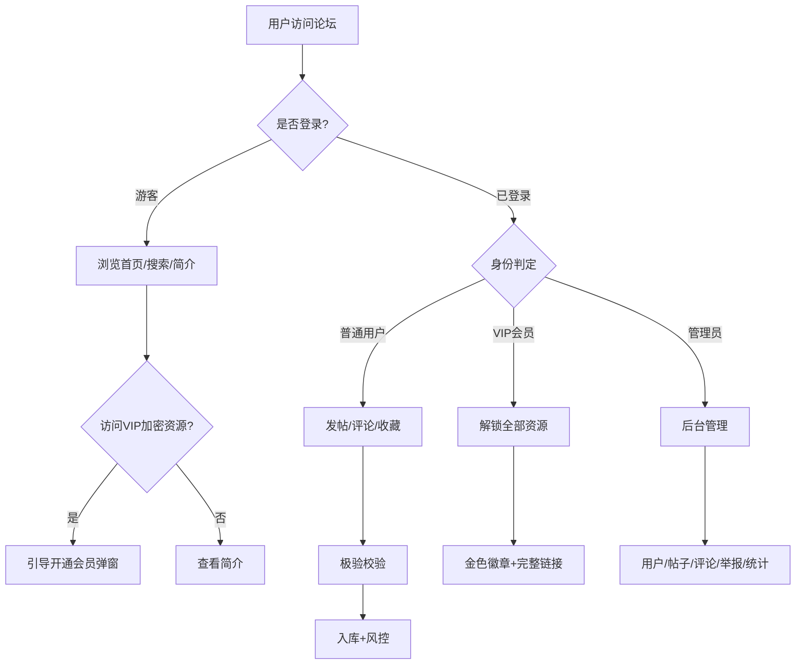

# 软件/影视网盘资源分享论坛 - 产品需求文档（PRD）

## 1. 产品概述

本项目是一个部署于 Vercel 的**资源分享论坛**，聚焦软件工具与影视剧集网盘资源社区，集成用户体系、发帖、楼中楼评论、VIP会员权限、管理员后台、极验GeeTest四代无感验证等完整能力。

- **目标用户**：寻找/分享软件与影视网盘资源的国内用户，覆盖游客、注册用户、VIP会员、管理员四层身份
- **核心价值**：合规、防刷、可商用的国内资源社区，全链路人机验证 + 权限隔离 + 移动端自适应，规避 Vercel 下架风险
- **部署目标**：Vercel 免费套餐可一键部署，无本地文件读写，无长连接，无超时

---

## 2. 核心功能

### 2.1 用户角色

| 角色 | 注册方式 | 核心权限 |
|------|---------|---------|
| 游客 | 无需注册 | 浏览帖子简介、首页列表、搜索；网盘链接/提取码完全隐藏 |
| 普通用户 | 邮箱注册（极验校验） | 浏览公开资源完整链接、发帖、评论、收藏、举报、个人中心 |
| VIP会员 | 管理员开通/续费 | 解锁全部公开+VIP加密资源，金色专属徽章，VIP倒计时 |
| 管理员 | 后台指定 | 用户/帖子/评论/举报/VIP/统计全套管理，全局操作权限 |

### 2.2 功能模块

1. **首页**：置顶资源、最新资源、热门资源三大分区，分类筛选、搜索、分页
2. **登录注册页**：邮箱注册+登录，内置极验GeeTest4无感验证
3. **发布资源页**：软件/影视双分类，封面图上传，网盘类型/链接/提取码，VIP加密/置顶开关
4. **帖子详情页**：资源展示、VIP权限隐藏、楼中楼评论、举报、收藏
5. **VIP专区页**：会员权益介绍、开通引导、时效说明
6. **个人中心**：资料编辑、我的帖子/评论/收藏/浏览记录
7. **管理员后台**：用户/帖子/评论/举报/统计看板五大模块
8. **合规页面**：用户协议、隐私政策、404、无权限、免责声明

### 2.3 页面详情

| 页面名称 | 模块名称 | 功能描述 |
|---------|---------|---------|
| 首页 `/` | 顶部导航 | 全局导航栏：首页/分类/发布/个人中心/VIP/后台 |
| 首页 `/` | 搜索栏 | 标题模糊搜索 + 多维筛选（分类/时间/热度） |
| 首页 `/` | 置顶资源区 | 置顶帖子卡片横滑展示 |
| 首页 `/` | 最新资源区 | 按发布时间倒序分页列表 |
| 首页 `/` | 热门资源区 | 浏览量+评论数加权排序 |
| 登录注册 `/login` | 表单切换 | 登录/注册Tab切换，正则校验、弱密码拦截 |
| 登录注册 `/login` | 极验组件 | 无感验证默认开启，风险设备弹滑块 |
| 发布资源 `/publish` | 资源表单 | 标题/简介/封面/网盘类型/链接/提取码/VIP加密/置顶 |
| 发布资源 `/publish` | 极验校验 | 提交前强制校验极验票据 |
| 帖子详情 `/post/[id]` | 资源信息 | 标题/简介/封面/作者/浏览量/发布时间 |
| 帖子详情 `/post/[id]` | 网盘区域 | 按权限脱敏/隐藏链接与提取码 |
| 帖子详情 `/post/[id]` | 评论区 | 楼中楼无限嵌套、分页加载、敏感词过滤 |
| 帖子详情 `/post/[id]` | 操作栏 | 收藏、举报、作者编辑/删除 |
| VIP专区 `/vip` | 权益介绍 | 会员权益、时效、开通引导 |
| 个人中心 `/user/[id]` | 资料卡 | 头像/昵称/简介/注册时长/发帖数/评论数 |
| 个人中心 `/user/[id]` | Tab页 | 我的帖子/评论/收藏/浏览记录 |
| 管理后台 `/admin` | 数据看板 | 总用户/帖子/评论/VIP/今日新增 |
| 管理后台 `/admin` | 用户管理 | 列表/封禁/VIP操作 |
| 管理后台 `/admin` | 帖子管理 | 审核/置顶/隐藏/删除 |
| 管理后台 `/admin` | 评论管理 | 分页/单删/批量清空 |
| 管理后台 `/admin` | 举报工单 | 处理/归档 |
| 合规页面 | 用户协议 | `/agreement` |
| 合规页面 | 隐私政策 | `/privacy` |
| 兜底页面 | 404 | 全局404兜底 |
| 兜底页面 | 无权限 | 无权限访问提示页 |

---

## 3. 核心流程

### 3.1 用户注册流程
用户填写邮箱密码 → 表单正则校验 → 极验无感验证 → 后端校验极验票据 → IP限流检查 → Supabase Auth创建用户 → 触发器创建user_profile → 返回成功

### 3.2 发帖流程
登录用户进入发布页 → 填写资源表单 → 极验校验 → 后端校验票据+权限 → XSS过滤+敏感词 → 网盘链接正则校验 → 防抖锁 → 入库 → 返回帖子ID

### 3.3 评论流程
登录用户在帖子页输入评论 → 极验校验 → 后端校验票据 → 空内容/纯符号拦截 → 敏感词过滤 → 防抖锁 → 入库 → 返回评论结构

### 3.4 VIP权限判定流程
访问帖子详情 → 后端读取用户is_vip+vip_expired_at → 实时判定VIP时效 → 游客隐藏链接/普通用户隐藏VIP加密资源/VIP解锁全部 → 前端按权限渲染

### 3.5 整体流程图

---

## 4. 用户界面设计

### 4.1 设计风格

- **主色调**：深色科技蓝（#0B1220 背景）+ 电光蓝（#3B82F6 主色）+ VIP金色（#F5C242 强调）
- **辅助色**：成功绿（#10B981）、警告橙（#F59E0B）、危险红（#EF4444）、中性灰阶
- **按钮风格**：圆角（rounded-lg）、主按钮渐变填充、次按钮描边、悬浮微动效
- **字体**：标题使用思源黑体（Noto Sans SC）粗体；正文使用系统默认无衬线；代码/链接使用等宽
- **布局风格**：顶部固定导航 + 内容居中容器（max-w-7xl）+ 卡片网格 + 移动端单列
- **图标风格**：Lucide React 线性图标，1.5px描边，与文字基线对齐
- **VIP金色UI**：会员徽章渐变金边、专属金色边框卡片、倒计时金色文字

### 4.2 页面设计概览

| 页面名称 | 模块名称 | UI元素 |
|---------|---------|--------|
| 首页 | Hero区 | 渐变背景、大标题、搜索框、统计数字 |
| 首页 | 资源卡片 | 封面图、标题、分类标签、作者、浏览量、VIP金色边框 |
| 首页 | 分区导航 | 置顶/最新/热门Tab切换、分类筛选侧栏 |
| 登录注册 | 表单卡 | 居中卡片、Tab切换、极验组件嵌入、密码可见切换 |
| 发布资源 | 表单 | 双列布局、封面上传预览、网盘类型单选、开关组件 |
| 帖子详情 | 资源头 | 大封面、标题、作者信息、浏览量、操作栏 |
| 帖子详情 | 网盘卡 | 按权限脱敏/模糊+解锁按钮、VIP金色边框 |
| 帖子详情 | 评论区 | 楼中楼缩进、头像、@回复、分页加载更多 |
| VIP专区 | 权益卡 | 金色渐变背景、权益列表、开通按钮、倒计时 |
| 个人中心 | 资料卡 | 头像、VIP徽章、注册时长、统计数字、Tab切换 |
| 管理后台 | 看板 | 数字卡片、图表、表格、操作按钮 |
| 兜底页 | 404/无权限 | 居中插画、提示文案、返回按钮 |

### 4.3 响应式适配

- **桌面优先**：max-w-7xl 容器，多列网格，侧栏布局
- **平板**：max-w-4xl，双列变单列，侧栏折叠
- **移动端**：单列堆叠，导航折叠为汉堡菜单，触摸友好按钮（min-h 44px），评论缩进优化
- **极验组件**：自适应宽度，移动端弹窗不遮挡表单

---

## 5. 非功能性需求

### 5.1 安全合规
- 全站极验GeeTest4无感验证（注册/发帖/评论/改资料）
- IP限流（单IP 60次/分钟）
- 重复提交防抖锁（5秒内同一接口）
- XSS转义、敏感词过滤、网盘链接脱敏
- 封禁账号全局拦截
- 免责声明、版权告知、侵权下架通道、ICP备案位

### 5.2 性能
- Vercel 免费套餐兼容（函数≤10s、无本地文件读写）
- 评论分页加载（每页20条）
- 帖子列表分页（每页12条）
- 图片走 Supabase Storage CDN
- 骨架屏 + Loading 动画

### 5.3 可维护性
- 严格TS类型，禁止any
- 分层解耦：页面层/接口层/工具层/中间件层
- 极验工具独立封装（lib/geetest4.ts），可无缝替换阿里云/腾讯云
- 详细中文注释

---

## 6. 交付标准

1. 完整可运行 Next.js 14 TS 全量源码
2. 一键执行的 Supabase SQL 脚本（建表/触发器/RLS）
3. 极验GeeTest4 前后端完整封装
4. 标准化 vercel.json 部署配置
5. .env.example 环境变量模板
6. 分步部署教程文档
7. 代码无运行报错、无TS类型警告
8. 详细注释、分层清晰
