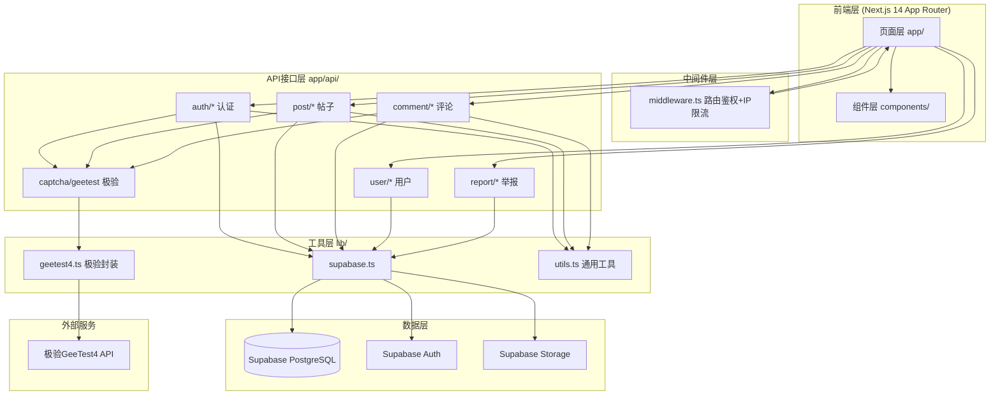
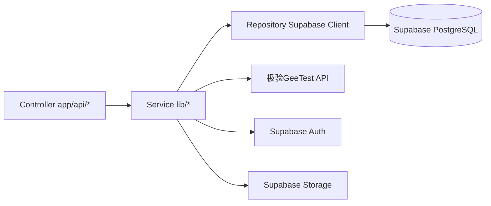
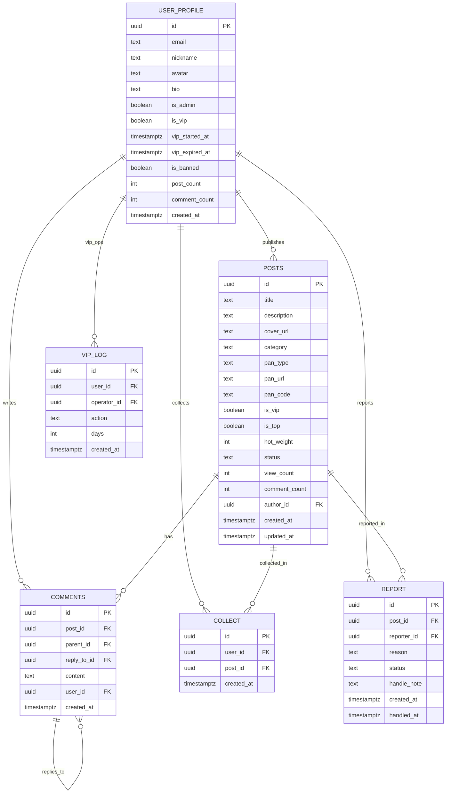

# 软件/影视网盘资源分享论坛 - 技术架构文档

## 1. 架构设计



## 2. 技术说明

- **前端框架**：Next.js 14+ App Router（TypeScript 严格模式）
- **样式**：TailwindCSS 3 + lucide-react 图标
- **初始化工具**：手动创建 package.json + 依赖安装
- **数据库**：Supabase PostgreSQL（Auth + 数据表 + Storage）
- **人机验证**：极验 GeeTest 4.0 四代无感验证（独立封装，可替换）
- **部署**：Vercel Hobby 免费套餐（Serverless Functions，无本地文件读写）
- **HTTP客户端**：原生 fetch + 服务端 Supabase SSR Client

## 3. 路由定义

| 路由 | 用途 | 权限 |
|------|------|------|
| `/` | 首页（置顶/最新/热门+搜索+筛选） | 公开 |
| `/login` | 登录+注册页（极验组件） | 公开 |
| `/publish` | 发布资源页 | 登录用户 |
| `/post/[id]` | 帖子详情+楼中楼评论 | 公开（按权限隐藏） |
| `/vip` | VIP会员权益介绍 | 公开 |
| `/user/[id]` | 个人中心（资料/帖子/评论/收藏/历史） | 登录用户 |
| `/admin` | 管理员后台首页（数据看板） | 管理员 |
| `/admin/users` | 用户管理 | 管理员 |
| `/admin/posts` | 帖子管理 | 管理员 |
| `/admin/comments` | 评论管理 | 管理员 |
| `/admin/reports` | 举报工单管理 | 管理员 |
| `/agreement` | 用户协议 | 公开 |
| `/privacy` | 隐私政策 | 公开 |
| `/404` | 全局404兜底 | 公开 |
| `/unauthorized` | 无权限提示页 | 公开 |

### API 路由

| 接口路径 | 方法 | 用途 | 极验校验 |
|---------|------|------|---------|
| `/api/auth/register` | POST | 邮箱注册 | ✅ |
| `/api/auth/login` | POST | 邮箱登录 | ❌ |
| `/api/auth/logout` | POST | 退出登录 | ❌ |
| `/api/auth/profile` | GET/PUT | 获取/编辑资料 | PUT校验 |
| `/api/captcha/geetest` | POST | 极验后端票据校验 | - |
| `/api/post/create` | POST | 发布帖子 | ✅ |
| `/api/post/list` | GET | 帖子分页查询 | ❌ |
| `/api/post/detail` | GET | 帖子详情 | ❌ |
| `/api/post/update` | PUT | 编辑帖子 | ❌ |
| `/api/post/delete` | DELETE | 删除帖子 | ❌ |
| `/api/comment/add` | POST | 新增评论 | ✅ |
| `/api/comment/list` | GET | 评论分页查询 | ❌ |
| `/api/comment/delete` | DELETE | 删除评论 | ❌ |
| `/api/user/vip-set` | POST | 管理员VIP操作 | ❌ |
| `/api/user/ban` | POST | 管理员封禁用户 | ❌ |
| `/api/report/submit` | POST | 提交举报 | ❌ |
| `/api/collect/toggle` | POST | 收藏/取消收藏 | ❌ |
| `/api/collect/list` | GET | 我的收藏列表 | ❌ |
| `/api/history/list` | GET | 浏览记录列表 | ❌ |
| `/api/admin/stats` | GET | 后台数据统计 | ❌ |
| `/api/admin/posts` | GET | 后台帖子列表 | ❌ |
| `/api/admin/comments` | GET | 后台评论列表 | ❌ |
| `/api/admin/reports` | GET | 后台举报列表 | ❌ |

## 4. API 定义

### 4.1 统一响应格式

```typescript
// 统一响应类型
interface ApiResponse<T = unknown> {
  code: number;        // 业务状态码：0成功，非0失败
  message: string;     // 提示文案
  data?: T;            // 业务数据
}

// 标准HTTP状态码使用
// 200 成功 / 400 参数错误 / 401 未登录 / 403 无权限或极验失败 / 404 不存在
// 429 限流 / 500 服务器错误
```

### 4.2 核心类型定义

```typescript
// 用户角色
type UserRole = 'guest' | 'user' | 'vip' | 'admin';

// 帖子分类
type PostCategory = 'software' | 'movie';

// 网盘类型
type PanType = 'baidu' | 'aliyun' | 'quark';

// 帖子状态
type PostStatus = 'normal' | 'pending' | 'hidden';

// 用户资料
interface UserProfile {
  id: string;
  email: string;
  nickname: string;
  avatar: string;
  bio: string;
  is_admin: boolean;
  is_vip: boolean;
  vip_started_at: string | null;
  vip_expired_at: string | null;
  is_banned: boolean;
  post_count: number;
  comment_count: number;
  created_at: string;
}

// 帖子
interface Post {
  id: string;
  title: string;
  description: string;
  cover_url: string;
  category: PostCategory;
  pan_type: PanType;
  pan_url: string;
  pan_code: string;
  is_vip: boolean;
  is_top: boolean;
  hot_weight: number;
  status: PostStatus;
  view_count: number;
  comment_count: number;
  author_id: string;
  author_nickname: string;
  author_avatar: string;
  created_at: string;
}

// 评论（楼中楼）
interface Comment {
  id: string;
  post_id: string;
  parent_id: string | null;
  reply_to_id: string | null;
  reply_to_nickname: string | null;
  content: string;
  user_id: string;
  user_nickname: string;
  user_avatar: string;
  children?: Comment[];
  created_at: string;
}
```

## 5. 服务端架构图



### 分层职责
- **Controller（app/api/）**：参数校验、极验票据校验、调用Service、统一响应
- **Service（lib/）**：业务逻辑、风控（限流/防抖/XSS/敏感词）、权限判定
- **Repository（lib/supabase.ts）**：数据访问、RLS策略依赖、Storage操作

## 6. 数据模型

### 6.1 ER图



### 6.2 DDL（Supabase PostgreSQL）

```sql
-- 启用必要扩展
create extension if not exists "pgcrypto";

-- ========== 1. user_profile 用户资料扩展表 ==========
create table if not exists public.user_profile (
    id uuid primary key references auth.users(id) on delete cascade,
    email text not null,
    nickname text not null default '',
    avatar text not null default '',
    bio text not null default '',
    is_admin boolean not null default false,
    is_vip boolean not null default false,
    vip_started_at timestamptz,
    vip_expired_at timestamptz,
    is_banned boolean not null default false,
    post_count integer not null default 0,
    comment_count integer not null default 0,
    created_at timestamptz not null default now()
);
create index idx_user_profile_email on public.user_profile(email);
create index idx_user_profile_is_vip on public.user_profile(is_vip);

-- ========== 2. posts 资源帖子主表 ==========
create table if not exists public.posts (
    id uuid primary key default gen_random_uuid(),
    title text not null,
    description text not null default '',
    cover_url text not null default '',
    category text not null check (category in ('software','movie')),
    pan_type text not null check (pan_type in ('baidu','aliyun','quark')),
    pan_url text not null,
    pan_code text not null default '',
    is_vip boolean not null default false,
    is_top boolean not null default false,
    hot_weight integer not null default 0,
    status text not null default 'normal' check (status in ('normal','pending','hidden')),
    view_count integer not null default 0,
    comment_count integer not null default 0,
    author_id uuid not null references public.user_profile(id) on delete cascade,
    created_at timestamptz not null default now(),
    updated_at timestamptz not null default now()
);
create index idx_posts_status_created on public.posts(status, created_at desc);
create index idx_posts_category on public.posts(category);
create index idx_posts_is_top on public.posts(is_top);
create index idx_posts_author on public.posts(author_id);
create index idx_posts_title on public.posts using gin(to_tsvector('simple', title));

-- ========== 3. comments 多层嵌套评论表 ==========
create table if not exists public.comments (
    id uuid primary key default gen_random_uuid(),
    post_id uuid not null references public.posts(id) on delete cascade,
    parent_id uuid references public.comments(id) on delete cascade,
    reply_to_id uuid references public.comments(id) on delete set null,
    reply_to_nickname text,
    content text not null,
    user_id uuid not null references public.user_profile(id) on delete cascade,
    created_at timestamptz not null default now()
);
create index idx_comments_post on public.comments(post_id, created_at desc);
create index idx_comments_parent on public.comments(parent_id);
create index idx_comments_user on public.comments(user_id);

-- ========== 4. report 举报记录表 ==========
create table if not exists public.report (
    id uuid primary key default gen_random_uuid(),
    post_id uuid not null references public.posts(id) on delete cascade,
    reporter_id uuid not null references public.user_profile(id) on delete cascade,
    reason text not null,
    status text not null default 'pending' check (status in ('pending','handled','archived')),
    handle_note text,
    created_at timestamptz not null default now(),
    handled_at timestamptz
);
create index idx_report_status on public.report(status);

-- ========== 5. collect 收藏关联表 ==========
create table if not exists public.collect (
    id uuid primary key default gen_random_uuid(),
    user_id uuid not null references public.user_profile(id) on delete cascade,
    post_id uuid not null references public.posts(id) on delete cascade,
    created_at timestamptz not null default now(),
    unique(user_id, post_id)
);
create index idx_collect_user on public.collect(user_id, created_at desc);

-- ========== 6. vip_log VIP操作日志表 ==========
create table if not exists public.vip_log (
    id uuid primary key default gen_random_uuid(),
    user_id uuid not null references public.user_profile(id) on delete cascade,
    operator_id uuid not null references public.user_profile(id) on delete cascade,
    action text not null check (action in ('open','renew','cancel')),
    days integer not null default 0,
    created_at timestamptz not null default now()
);
create index idx_vip_log_user on public.vip_log(user_id, created_at desc);

-- ========== 触发器：新用户注册自动创建 user_profile ==========
create or replace function public.handle_new_user()
returns trigger
language plpgsql
security definer set search_path = public
as $$
begin
    insert into public.user_profile (id, email, nickname)
    values (new.id, new.email, coalesce(new.raw_user_meta_data->>'nickname', split_part(new.email,'@',1)));
    return new;
end;
$$;

drop trigger if exists on_auth_user_created on auth.users;
create trigger on_auth_user_created
    after insert on auth.users
    for each row execute function public.handle_new_user();

-- ========== 触发器：posts.comment_count 自动维护 ==========
create or replace function public.update_comment_count()
returns trigger
language plpgsql
as $$
begin
    if (tg_op = 'INSERT') then
        update public.posts set comment_count = comment_count + 1 where id = new.post_id;
        update public.user_profile set comment_count = comment_count + 1 where id = new.user_id;
        return new;
    elsif (tg_op = 'DELETE') then
        update public.posts set comment_count = greatest(comment_count - 1, 0) where id = old.post_id;
        update public.user_profile set comment_count = greatest(comment_count - 1, 0) where id = old.user_id;
        return old;
    end if;
    return null;
end;
$$;

drop trigger if exists trg_comments_count on public.comments;
create trigger trg_comments_count
    after insert or delete on public.comments
    for each row execute function public.update_comment_count();

-- ========== 触发器：user_profile.post_count 自动维护 ==========
create or replace function public.update_post_count()
returns trigger
language plpgsql
as $$
begin
    if (tg_op = 'INSERT') then
        update public.user_profile set post_count = post_count + 1 where id = new.author_id;
        return new;
    elsif (tg_op = 'DELETE') then
        update public.user_profile set post_count = greatest(post_count - 1, 0) where id = old.author_id;
        return old;
    end if;
    return null;
end;
$$;

drop trigger if exists trg_posts_count on public.posts;
create trigger trg_posts_count
    after insert or delete on public.posts
    for each row execute function public.update_post_count();

-- ========== RLS 策略 ==========
alter table public.user_profile enable row level security;
alter table public.posts enable row level security;
alter table public.comments enable row level security;
alter table public.report enable row level security;
alter table public.collect enable row level security;
alter table public.vip_log enable row level security;

-- user_profile：本人可读，本人可改自己资料，管理员全权
create policy "profile_read_self_or_public" on public.user_profile
    for select using (auth.uid() = id or exists(select 1 from public.user_profile p where p.id = auth.uid() and p.is_admin = true));
create policy "profile_update_self" on public.user_profile
    for update using (auth.uid() = id);

-- posts：所有人可读正常帖，登录用户可发帖，作者/管理员可改可删
create policy "posts_read_normal" on public.posts
    for select using (status = 'normal' or author_id = auth.uid() or exists(select 1 from public.user_profile p where p.id = auth.uid() and p.is_admin = true));
create policy "posts_insert_auth" on public.posts
    for insert with check (author_id = auth.uid());
create policy "posts_update_owner_admin" on public.posts
    for update using (author_id = auth.uid() or exists(select 1 from public.user_profile p where p.id = auth.uid() and p.is_admin = true));
create policy "posts_delete_owner_admin" on public.posts
    for delete using (author_id = auth.uid() or exists(select 1 from public.user_profile p where p.id = auth.uid() and p.is_admin = true));

-- comments：登录可读，登录可发，作者/管理员可删
create policy "comments_read_all" on public.comments
    for select using (true);
create policy "comments_insert_auth" on public.comments
    for insert with check (user_id = auth.uid());
create policy "comments_delete_owner_admin" on public.comments
    for delete using (user_id = auth.uid() or exists(select 1 from public.user_profile p where p.id = auth.uid() and p.is_admin = true));

-- report：登录可读自己的，登录可提交，管理员可读全部
create policy "report_read_self_admin" on public.report
    for select using (reporter_id = auth.uid() or exists(select 1 from public.user_profile p where p.id = auth.uid() and p.is_admin = true));
create policy "report_insert_auth" on public.report
    for insert with check (reporter_id = auth.uid());

-- collect：仅本人可读可写
create policy "collect_owner_all" on public.collect
    for all using (user_id = auth.uid()) with check (user_id = auth.uid());

-- vip_log：管理员可读，本人可读
create policy "vip_log_read" on public.vip_log
    for select using (user_id = auth.uid() or operator_id = auth.uid() or exists(select 1 from public.user_profile p where p.id = auth.uid() and p.is_admin = true));

-- ========== Storage Bucket ==========
insert into storage.buckets (id, name, public) values ('covers','covers', true) on conflict (id) do nothing;

-- Storage 策略：登录用户可上传封面，所有人可读
create policy "covers_read_public" on storage.objects for select using (bucket_id = 'covers');
create policy "covers_upload_auth" on storage.objects for insert with check (bucket_id = 'covers' and auth.role() = 'authenticated');
create policy "covers_delete_owner" on storage.objects for delete using (bucket_id = 'covers' and owner = auth.uid());
```

## 7. 项目目录结构

```
/
├── app/
│   ├── page.tsx                      # 首页
│   ├── layout.tsx                    # 全局布局+导航
│   ├── globals.css                   # 全局样式
│   ├── not-found.tsx                 # 404兜底
│   ├── login/page.tsx                # 登录注册
│   ├── publish/page.tsx              # 发布资源
│   ├── post/[id]/page.tsx            # 帖子详情+评论
│   ├── vip/page.tsx                  # VIP专区
│   ├── user/[id]/page.tsx            # 个人中心
│   ├── admin/
│   │   ├── page.tsx                  # 数据看板
│   │   ├── users/page.tsx            # 用户管理
│   │   ├── posts/page.tsx            # 帖子管理
│   │   ├── comments/page.tsx         # 评论管理
│   │   └── reports/page.tsx          # 举报管理
│   ├── agreement/page.tsx            # 用户协议
│   ├── privacy/page.tsx              # 隐私政策
│   ├── unauthorized/page.tsx         # 无权限页
│   └── api/
│       ├── auth/
│       │   ├── register/route.ts
│       │   ├── login/route.ts
│       │   ├── logout/route.ts
│       │   └── profile/route.ts
│       ├── captcha/geetest/route.ts
│       ├── post/
│       │   ├── create/route.ts
│       │   ├── list/route.ts
│       │   ├── detail/route.ts
│       │   ├── update/route.ts
│       │   └── delete/route.ts
│       ├── comment/
│       │   ├── add/route.ts
│       │   ├── list/route.ts
│       │   └── delete/route.ts
│       ├── user/vip-set/route.ts
│       ├── user/ban/route.ts
│       ├── report/submit/route.ts
│       ├── collect/
│       │   ├── toggle/route.ts
│       │   └── list/route.ts
│       ├── history/list/route.ts
│       └── admin/
│           ├── stats/route.ts
│           ├── posts/route.ts
│           ├── comments/route.ts
│           └── reports/route.ts
├── components/
│   ├── Navbar.tsx                    # 全局导航
│   ├── Footer.tsx                    # 全局底部+免责声明
│   ├── PostCard.tsx                  # 帖子卡片
│   ├── CommentTree.tsx               # 楼中楼评论
│   ├── GeetestWidget.tsx             # 极验前端组件
│   ├── Loading.tsx                   # Loading动画
│   ├── Toast.tsx                     # 弹窗提示
│   ├── Empty.tsx                     # 空状态
│   ├── VipBadge.tsx                  # VIP金色徽章
│   ├── Pagination.tsx                # 分页
│   └── Skeleton.tsx                  # 骨架屏
├── lib/
│   ├── supabase.ts                   # Supabase客户端
│   ├── supabase-server.ts            # 服务端Supabase客户端
│   ├── geetest4.ts                   # 极验四代封装
│   ├── auth.ts                       # 权限工具
│   ├── rate-limit.ts                 # IP限流
│   ├── security.ts                   # XSS/敏感词/防抖
│   ├── types.ts                      # 全局TS类型
│   └── utils.ts                      # 通用工具
├── middleware.ts                     # 路由鉴权+IP限流
├── public/
├── sql/
│   └── schema.sql                    # 完整SQL脚本
├── docs/
│   └── DEPLOY.md                     # 部署教程
├── tailwind.config.js
├── vercel.json
├── next.config.js
├── tsconfig.json
├── package.json
└── .env.example
```

## 8. 极验GeeTest4 封装设计（可替换）

```typescript
// lib/geetest4.ts 抽象接口
export interface CaptchaProvider {
  verifyTicket(params: { lot_number: string; captcha_output: string; pass_token: string; gen_time: string }): Promise<boolean>;
}

// 极验实现
export class Geetest4Provider implements CaptchaProvider { ... }

// 工厂函数（后续可切换阿里云/腾讯云）
export function getCaptchaProvider(): CaptchaProvider {
  return new Geetest4Provider();
}
```

业务接口仅依赖 `CaptchaProvider` 接口，切换服务商仅需新增 Provider 实现并修改工厂函数。
